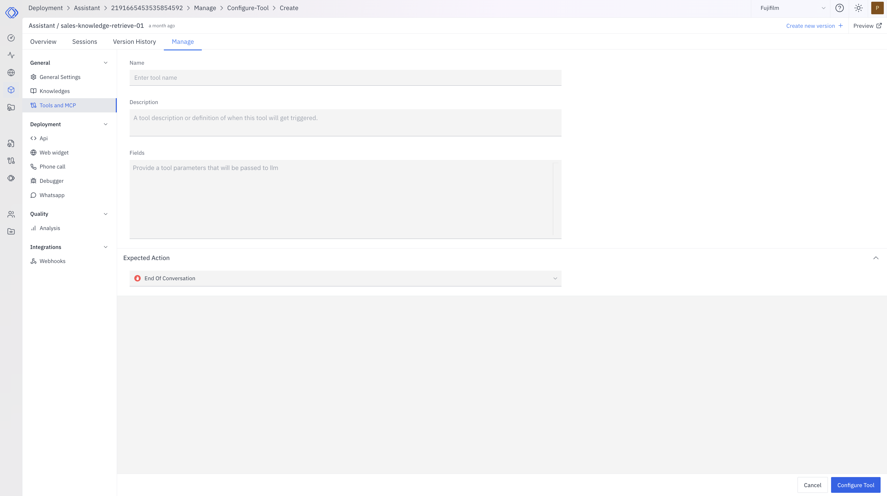

The End of Conversation Tool allows your assistant to explicitly signal when a conversation should end. This guide will walk you through the process of adding and configuring this tool for your assistant.

## Prerequisites

Before adding the End of Conversation Tool, ensure that you have:

- [Created an assistant](/assistants/create-assistant)

## Adding the End of Conversation Tool

<Steps>
  <Step title="Navigate to Your Assistant">
    1. Go to the Assistants section in the main navigation menu.
    2. Select the assistant you want to configure.
    3. Navigate to the "Manage" -> "Configure Tool" tab.
    4. Click on **Create** to add a new tool.
  </Step>

  <Step title="Select the End of Conversation Tool">
  
    1. From the list of available tools, find "End of Conversation".
    2. Click on it to start configuring the tool.
  </Step>

  <Step title="Configure the Tool">
    Configure the End of Conversation Tool with the following settings:
    
    <AccordionGroup>
    <Accordion title="Tool Name">
      End of Conversation
    </Accordion>

    <Accordion title="Description">
      Use this tool to signal the end of a conversation when appropriate.
    </Accordion>

    <Accordion title="Fields">
      <Accordion title="Expected Action">
        - **Type**: String
        - **Description**: A brief description of why the conversation is ending
        - **Required**: Yes
      </Accordion>
    </Accordion>
    </AccordionGroup>
  </Step>

  <Step title="Save Configuration">
    After configuring the tool, click on the **Configure Tool** button to save your changes.
  </Step>
</Steps>

## Using the End of Conversation Tool

Once configured, your assistant can use the End of Conversation Tool when appropriate. The process typically follows these steps:

1. The assistant determines that the conversation has reached a natural conclusion.
2. It calls the End of Conversation Tool with a brief explanation.
3. The conversation is marked as ended, and the assistant stops generating further responses.

## Managing the End of Conversation Tool

You can modify or remove the End of Conversation Tool at any time:

1. Go to your assistant's "Manage" -> "Configure Tool" tab.
2. Find the End of Conversation Tool in the list.
3. Click on it to modify its configuration or remove it.

## Best Practices

- Use the tool when the conversation has reached a logical conclusion.
- Ensure the assistant provides a clear and polite closing message before ending the conversation.
- Configure the tool to align with your specific use case and conversation flow.
- Regularly review conversations to ensure the tool is being used appropriately.

By effectively configuring and utilizing the End of Conversation Tool, your assistant can gracefully conclude interactions, improving user experience and conversation management.