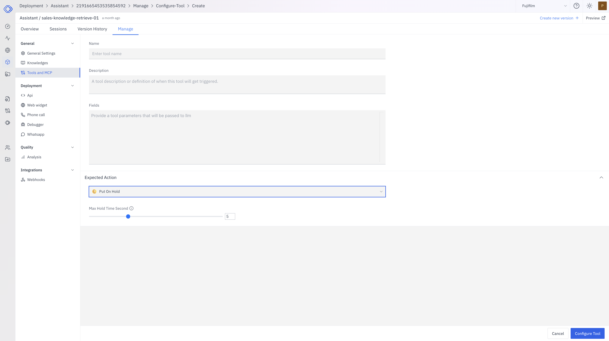

The Put On Hold Tool allows your assistant to temporarily pause or put a phone call on hold for a specified number of minutes. This guide will walk you through the process of adding and configuring this tool for your assistant.

## Prerequisites

Before adding the Put On Hold Tool, ensure that you have:

- [Created an assistant](/assistants/create-assistant)

## Adding the Put On Hold Tool

<Steps>
  <Step title="Navigate to Your Assistant">
    1. Go to the Assistants section in the main navigation menu.
    2. Select the assistant you want to configure.
    3. Navigate to the "Manage" -> "Configure Tool" tab.
    4. Click on **Create** to add a new tool.
  </Step>

  <Step title="Select the Put On Hold Tool">
  

    1. From the list of available tools, find "Put On Hold".
    2. Click on it to start configuring the tool.
  </Step>

  <Step title="Configure the Tool">
    Configure the Put On Hold Tool with the following settings:
    
    <AccordionGroup>
    <Accordion title="Tool Name">
      Put On Hold
    </Accordion>

    <Accordion title="Description">
      Use this tool to pause the phone call or stop responding for a specified duration.
    </Accordion>

    <Accordion title="Fields">
      <Accordion title="Expected Action">
        - **Type**: String
        - **Description**: Put On Hold
        - **Required**: Yes
      </Accordion>

      <Accordion title="Hold Time (in minutes)">
        - **Type**: Number
        - **Description**: The duration in minutes for which the call should be put on hold
        - **Required**: Yes
        - **Default**: 1
        - **Min**: 1
        - **Max**: 5
      </Accordion>
    </Accordion>
    </AccordionGroup>
  </Step>

  <Step title="Save Configuration">
    After configuring the tool, click on the **Configure Tool** button to save your changes.
  </Step>
</Steps>

## Using the Put On Hold Tool

Once configured, your assistant can use the Put On Hold Tool when appropriate. The process typically follows these steps:

1. The assistant determines a need to pause the conversation or put the call on hold.
2. It calls the Put On Hold Tool with the specified duration.
3. The tool pauses the conversation for the specified number of minutes.
4. After the hold time expires, the assistant resumes the conversation.

## Managing the Put On Hold Tool

You can modify or remove the Put On Hold Tool at any time:

1. Go to your assistant's "Manage" -> "Configure Tool" tab.
2. Find the Put On Hold Tool in the list.
3. Click on it to modify its configuration or remove it.

## Best Practices

- Use the Put On Hold Tool judiciously to avoid prolonged interruptions in the conversation.
- Ensure that the assistant provides a clear explanation to the user before putting the call on hold.
- Consider implementing a callback mechanism if the hold time needs to be extended.
- Regularly review the usage of this tool to optimize the user experience.

By effectively configuring and utilizing the Put On Hold Tool, your assistant can manage conversations more efficiently, allowing for necessary pauses or hold times during phone calls.